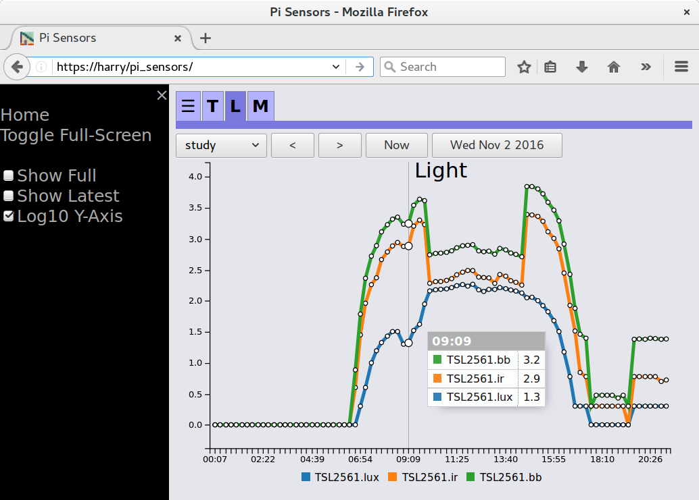

# Raspberry Pi Sensors - Client and Server.

This project provides client side sensor code, running on one or more
Raspberry Pi computers that push sensor readings to one or more servers.
The server, which could also run on a Pi, saves readings to a MongoDB
database. The server web application reads from the database to display
charts of sensor readings per-sensor per-day, with the ability to look
at historic data.

By default, readings are generated every 15 minutes.  Actual
measurements are made several times a minute and the maximum, minimum
and mean readings calculated.

The following sensors are currently supported but it should be simple to
add others. Each is optional for a specific client.
```
Pressure and temperature sensor - BMP180
Temperature, pressure and humidity sensor - BME280
Temperature, pressure, humidity and air quality sensor - BME680
Temperature sensor - MCP9808
Temperature sensor - DS18B20
Temperature and humidity sensors - Adafruit DHT11, DHT22 and AM2302
Movement sensor - RCW-0506
Light sensor - TSL2561
Temperature, pressure and humidity sensors - Sense Hat
```
In addition, temperature, pressure and humidity reading from
openweathermap.org can be recorded and an optional i2c LCD is can be
used to display current sensor values.

#### Examples
This document contains snippets of code to help install and configure
Pi Sensors.  To use most of these snippets directly, set the following
shell variables to refer to your code locations.
```
export CODEBASE=$HOME/pi_sensors
export DEPSBASE=$HOME/pi_sensors_dependencies
```



## Setting up the server
The server uses MongoDB to store sensor readings with a python-flask
based API application. You can either configure the API application to
use a local flask server or configure to use WSGI with your web server.
Only the Apache web server has been tested.  The following packages are
required, for example on a Debian based system. Up to date packages from
mongodb.com are recommended for the database over those that come with
most Linux distributions.
```
sudo apt-get install apache2 python-pymongo mongodb python-flask libapache2-mod-wsgi
```

#### Configure the Database API
To set-up the API, a configuration file is needed for the database.
This configuration file can be generated then edited. Be sure to specify
the database name, this is unset by default; a good name could be
"pi_sensors".  For example:
```
cd $CODEBASE/server
# remove or move any existing config file
[ -r config/mongodb_config.json ] && mv config/mongodb_config.json config/mongodb_config.json.old
api/common.py > new_config
mv new_config config/mongodb_config.json
vi config/mongodb_config.json
# check the configuration is correct
api/common.py
```

#### Configure the web server
Create a WSGI configuration file appropriate for you code path.  This
can be generated from a provided template.  For example:
```
cd $CODEBASE/server/api
cp ../config/template_pi_sensors_api.wsgi pi_sensors_api.wsgi
sed -i "s|###path-to-api###|$CODEBASE/server/api|g" pi_sensors_api.wsgi
vi pi_sensors_api.wsgi
```

Assuming a Apache web server, modify config/pi_sensors-apache.conf to
point at your html and api directories.  Copy the modified file to
/etc/apache2/conf-available/, enable the configuration and reload the
server. For example:
```
cd $CODEBASE/server/config
cp template_pi_sensors_apache.conf pi_sensors_apache.conf
sed -i "s|###path-to-html###|$CODEBASE/server/html|g" pi_sensors_apache.conf
sed -i "s|###path-to-api###|$CODEBASE/server/api|g" pi_sensors_apache.conf
vi pi_sensors_apache.conf
sudo cp pi_sensors_apache.conf /etc/apache2/conf-available/
rm pi_sensors_apache.conf
sudo a2enconf pi_sensors_apache
```
Enable WSGI execution, then restart your Apache server
```
sudo a2enmod wsgi
sudo service apache2 reload
```

#### Configure paths and other options used by JavaScript
Copy server/config/template_pi_sensors_config.js to html/pi_sensors_config.js then modify the file
to refer to your api directory. You can also alter other options in this file such as the auto
update timer.  To copy and modify the file you can use:
```
cd $CODEBASE/server/config
cp template_pi_sensors_config.js pi_sensors_config.js
vi pi_sensors_config.js
mv pi_sensors_config.js ../html
```

#### Get JavaScript libraries
Download the JavaScript libraries for c3, d3, jquery and jquery-ui,
unpack them and add the required files to the html/lib directory. For
example:
```
mkdir -p $DEPSBASE/js_libraries && cd $DEPSBASE/js_libraries
wget -qO - https://github.com/c3js/c3/archive/v0.4.24.tar.gz | tar xzv
wget -q https://github.com/d3/d3/releases/download/v3.5.17/d3.zip && unzip -d d3-v3.5.17 d3.zip && rm d3.zip
mkdir -p jquery-3.3.1 && cd jquery-3.3.1 && wget -qO jquery.min.js https://code.jquery.com/jquery-3.3.1.min.js && cd ..
wget https://jqueryui.com/resources/download/jquery-ui-1.12.1.zip && unzip jquery-ui-1.12.1.zip && rm jquery-ui-1.12.1.zip
cd $CODEBASE/server/html && mkdir -p lib && cd lib
ln -s $DEPSBASE/js_libraries/c3-0.4.24/c3.min.css
ln -s $DEPSBASE/js_libraries/c3-0.4.24/c3.min.js
ln -s $DEPSBASE/js_libraries/d3-v3.5.17/d3.min.js
ln -s $DEPSBASE/js_libraries/jquery-3.3.1/jquery.min.js
ln -s $DEPSBASE/js_libraries/jquery-ui-1.12.1/jquery-ui.min.css
ln -s $DEPSBASE/js_libraries/jquery-ui-1.12.1/jquery-ui.min.js
ln -s $DEPSBASE/js_libraries/jquery-ui-1.12.1/images
```

#### Testing the database set-up
These commands will write a record to the database and read it back
using curl (you may need to install curl. Be sure to specify your own
server certificate if needed (--cacert <file>) and URL. For example:
```
curl -X POST -d @- http://localhost/pi_sensors_api/add_reading << EOT
{ "date":$(date +"%Y%m%d"), "epoch":$(date +"%s"), "type":"temperature", "room":"testroom", "record":{"value": 42, "units":"C", "device":"MCP9808"} }
EOT
curl http://localhost/pi_sensors_api/testroom/temperature/latest
```
The output should be similar to this. If the status is false then check
your set-up.
```
{
    "status":true,
    "data":[
        {
            "date":20160816,
            "record":{
                "units":"C",
                "device":"MCP9808",
                "value":42
            },
            "epoch":1471384018,
            "type":"temperature",
            "room":"testroom"
        }
    ]
}
```

#### Create Database Indexes
Without too much performance tuning, creating some basic indexes for the
database does provide a significant improvement (~10x).  Be sure to use
the name of the database you have actually configured.  For example
using the mongo shell:
```
mongo

use pi_sensors
db.readings.dropIndexes()
db.readings.createIndex({"date":1, "type":1, "room":1, "epoch":1})
db.readings.createIndex({"date":-1, "type":-1, "room":-1, "epoch":-1})
```

#### Testing the web server
You should now be able to point your web browser at for example
/pi_sensors on your Apache web server.  If you select the "testroom"
and the date you used for testing the database, you should see your
data as a single data point.

## Setting up the Raspberry Pi Sensor clients
You can have any number of sensor clients, they all send readings back to
the server.  Each client needs to be configured for the sensors present.

You will need to enable i2c using the raspi-config for i2c sensors and
1-wire devices if you use the DS18B20.

#### Install additional Raspbian packages
```
sudo apt-get update
sudo apt-get install git python-requests python-dev python-gpiozero python-smbus git build-essential rng-tools
```

#### If you have the BMP180 pressure sensor...
Download and install the sensor driver.
```
mkdir -p $DEPSBASE && cd $DEPSBASE
git clone https://github.com/adafruit/Adafruit_Python_BMP.git
cd Adafruit_Python_BMP/
sudo python ./setup.py install
```

#### If you have the BME280 temperature/humidity/pressure sensor...
Download and install the sensor driver and its dependancies.
```
sudo apt-get install build-essential python-pip
mkdir -p $DEPSBASE && cd $DEPSBASE
git clone https://github.com/adafruit/Adafruit_Python_GPIO.git
cd Adafruit_Python_GPIO
sudo python setup.py install
```
```
mkdir -p $DEPSBASE && cd $DEPSBASE
git clone https://github.com/adafruit/Adafruit_Python_BME280.git
cd Adafruit_Python_BME280
cp Adafruit_BME280.py $CODEBASE/client/bin/
```

#### If you have the BME680 temperature/humidity/pressure/air quality sensor...
Download and install the sensor driver and its dependancies.
```
sudo apt install python-bme680
```
All the sensor settings can be controled from the config file but as a mimimum, you need to set the
readings control parameters and the humidity and gas baselines.  These example values should work
fine but you may want to set the gas baseline to something over the maximum you see in your own
data.  This will enable you to refine the air quality calculation.
```
    "BME680":{
        "average_over":3,
        "read_period":10,
        "humidity_baseline":40.0,
        "gas_baseline":500000.0
    },
```

#### If you have the MCP9808 temperature sensor...
Download and install the sensor driver.
```
mkdir -p $DEPSBASE && cd $DEPSBASE
git clone https://github.com/adafruit/Adafruit_Python_MCP9808
cd Adafruit_Python_MCP9808
sudo python ./setup.py install
```

#### If you have an Adafruit DHT11, DHT22 or AM2302 temperature/humidity sensor...
Download and install the sensor driver.
```
mkdir -p $DEPSBASE && cd $DEPSBASE
git clone https://github.com/adafruit/Adafruit_Python_DHT.git
cd Adafruit_Python_DHT
sudo python setup.py install
```

#### If you have the TSL2561 light sensor...
Download and compile the sensor driver.
```
mkdir -p $DEPSBASE && cd $DEPSBASE
git clone https://github.com/amolyp/TSL2561_Simple_Library.git
cd $CODEBASE/client/bin/
export TSL2561_PATH=$DEPSBASE/TSL2561_Simple_Library/
gcc -o TSL2561_get_readings -I$TSL2561_PATH TSL2561_get_readings.c $TSL2561_PATH/TSL2561.c 
```

#### If you have the Sense Hat and wish to use the sensors...
Install the sense hat python package.
```
sudo apt-get update && sudo apt-get install sense-hat
```

#### If you have the i2c LCD...
Download and install the sensor driver.
```
mkdir -p $DEPSBASE && cd $DEPSBASE
git clone https://bitbucket.org/ryanteckltd/16x2-python-i2c-lib.git
```
Then either use the provided install script or set-up manually, for example:
```
# derived from the 16x2-python-i2c-lib LCDinstall.sh script
cd $DEPSBASE/16x2-python-i2c-lib
export revision=`python -c "import RPi.GPIO as GPIO; print GPIO.RPI_REVISION"`
if [ $revision = "1" ]; then
	cp installConfigs/i2c_lib_0.py $CODEBASE/client/bin/i2c_lib.py
else
	cp installConfigs/i2c_lib_1.py $CODEBASE/client/bin/i2c_lib.py
fi
cp lcddriver.py $CODEBASE/client/bin/
```
The first line of the display always shows the current time and date but you can configure the
format.  The remaining lines can be configured to show readings from specified sensors.  View the
generated configuration file to see an example configuration.

#### Configure general client settings and sensors
The client configuration file is used to specify the which sensors are
available and any of the optional parameters for the sensors, such as
GPIO pins.  The server(s) URL and parameters is also specified.  Lastly
the client identifier, the room is specified.  A default configuration
file can be generated then edited as required. To disable a particular
sensor, remove the sections in the configuration file. For example:
```
cd $CODEBASE/client
mkdir -p config
# remove or move any existing config file
[ -r config/pi_config.json ] && mv config/pi_config.json config/pi_config.json.old
bin/pi_config.py > new_config
mv new_config config/pi_config.json
vi config/pi_config.json
# check the configuration is correct
bin/pi_config.py
```

#### Get certs for servers
If your server(s) use HTTPS, you will need to store the certificate
files in the configuration directory.  For example:
```
# base on http://serverfault.com/questions/644572/openssl-save-x509-certificate-of-a-website
cd $CODEBASE/client/config
for s in server1 server2
do
	echo "" | openssl s_client -host $s -port 443 | sed -ne '/-BEGIN CERTIFICATE-/,/-END CERTIFICATE-/p'  > $s.cert
done
```

#### Testing client set-up
You can try each of the sensor modules individually by executing the
specific python located in the client/bin directory.  You can also
run the run_all_pi_sensors.py python script to check the expected sensors
are configured, generate some initial readings and send them to the
server(s).
```
cd $CODEBASE/client/bin
./run_all_pi_sensors.py 10 1 testroom
```

#### Running the client as a system service
To automatically start pi sensors each time your pi is rebooted, you
can use the provided systemd service file.  To set up the service use:
```
mkdir -p $CODEBASE/client/config
cd $CODEBASE/client/config
sed "s|###path-to-code###|$CODEBASE|g" ../template_pi_sensors.service > pi_sensors.service
sed -i "s|###user###|$(id -un)|g" pi_sensors.service
sudo systemctl enable  $CODEBASE/client/config/pi_sensors.service
```
To start, stop, check the status or disable the service use:
```
sudo systemctl start pi_sensors.service
sudo systemctl stop pi_sensors.service
sudo systemctl status pi_sensors.service
sudo systemctl disable pi_sensors.service
```

To view or monitor the logging information use
```
journalctl -u pi_sensors.service
journalctl -u pi_sensors.service -f
```
